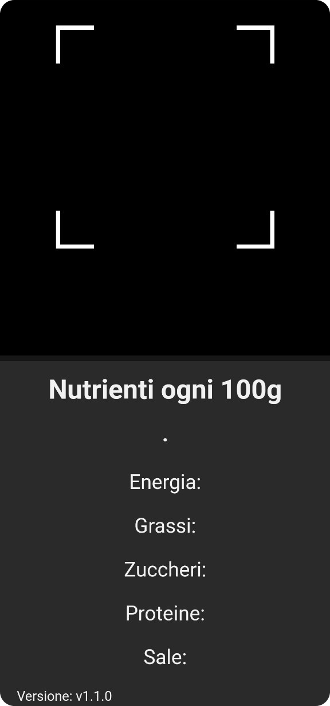

<p align="center">
	
</p>

# ✨ScannerMonaco - Una webapp leggera, solo l'essenziale
[ScannerMonaco ](https://scannermonaco.netlify.app "ScannerMonaco")è un progetto [scolastico](https://www.itimonaco.edu.it/ "scolastico") ideato per avere a disposizione uno scanner leggero alla porta di tutti.

## 💻 Showcase
<p align="center">
	
</p>

------------

# 🪄 Scarica il progetto in poco tempo via CLI
```bash
git clone https://github.com/peppestiks/ScannerMonaco.git && cd ScannerMonaco
```

### 👇 Linguaggi usati

  

#### 📊 Altro
<p> 🎞️ Lettore Codice a Barre  &rarr; https://github.com/mebjas/html5-qrcode </p>
<p> 📭 API &rarr; https://world.openfoodfacts.org/data  </p>
<p> 📑 Font &rarr; https://fonts.google.com/specimen/Montserrat </p>

## ⚠️ L'app è ancora in sviluppo
Chiedo scusa per eventuali problemi con la webapp, ancora è in fase di sviluppo e in continuo miglioramento .
